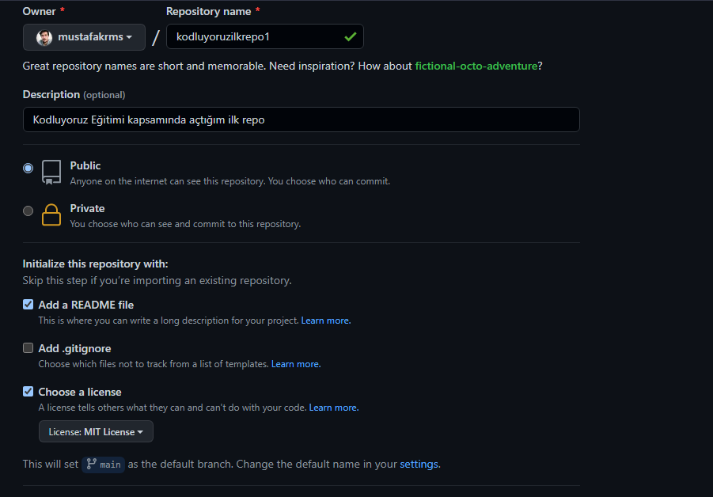

# Kodluyoruz İlk Repo
---
Bu repo [Kodluyoruz](https://www.kodluyoruz.org) Front-End eğitiminde oluşturduğumuz ilk repo. İçerisinde bir adet README dosyası, bir adet index.html barındırıyor.



## Installation

---
Öncelikle prjeyi clonlayın.
```
git clone https://github.com/mustafakrms/kodluyoruzilkrepo.git
```
## Usage

---

Projeyi cloneladıktan sonra Visual Studio Code programında açınız.

Linux için
```
cd kodluyoruzilkrepo
code .
```

## Contributing

---

Pull requestler kabul edilir. Büyük değişikliker için, Lütfen önce neyi değiştirmek istediğinizi tartışmak için bir konu çınız.

## License

---

[MIT](https://choosealicense.com/licenses/mit/)


